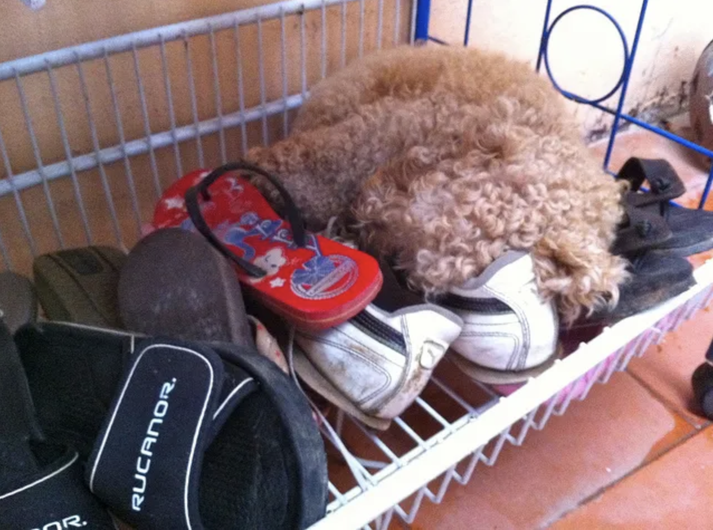
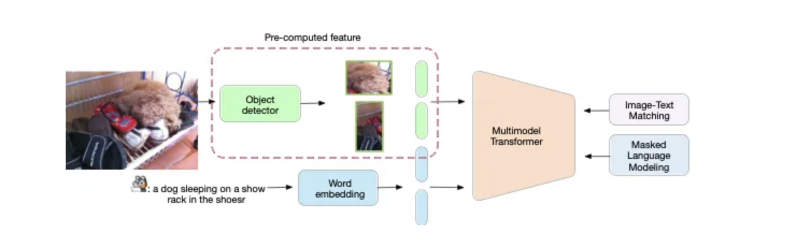
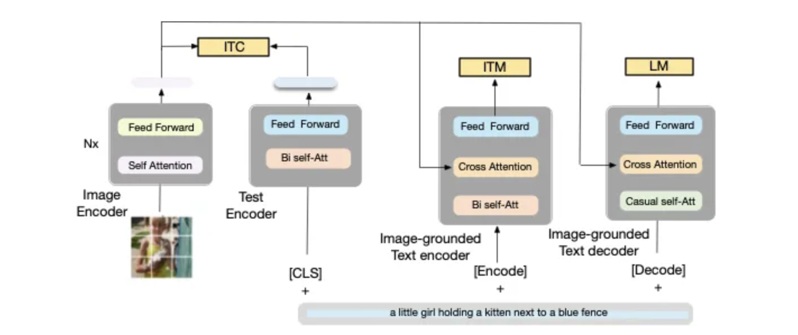
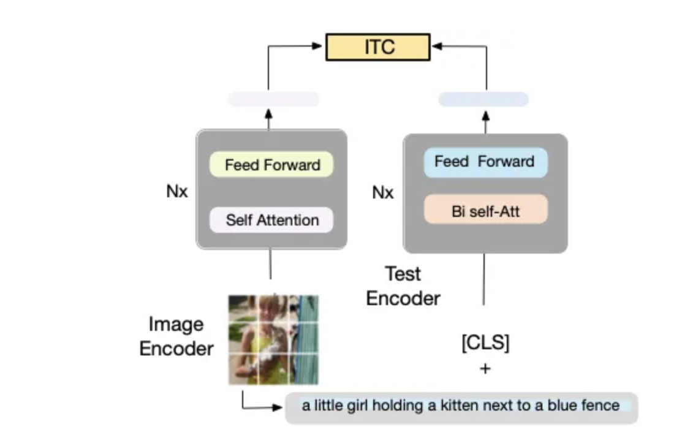
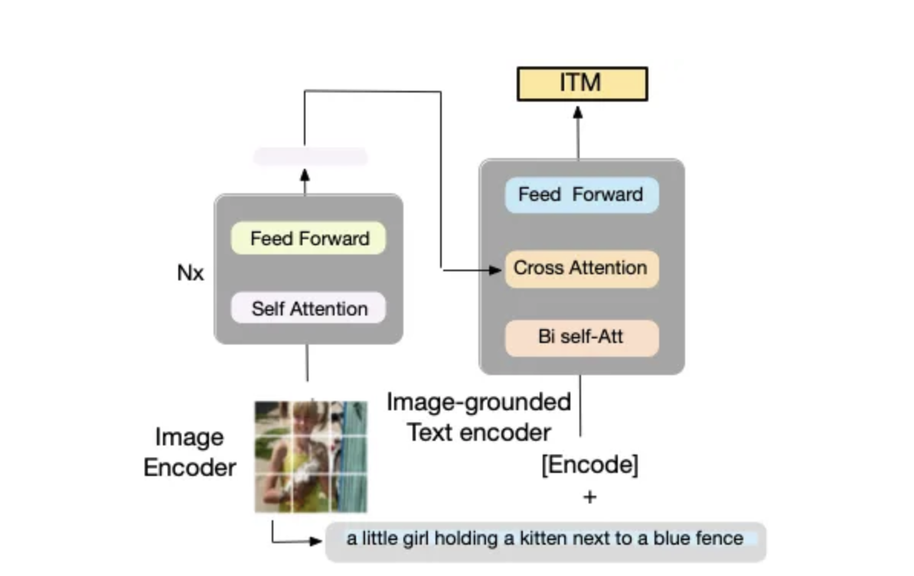
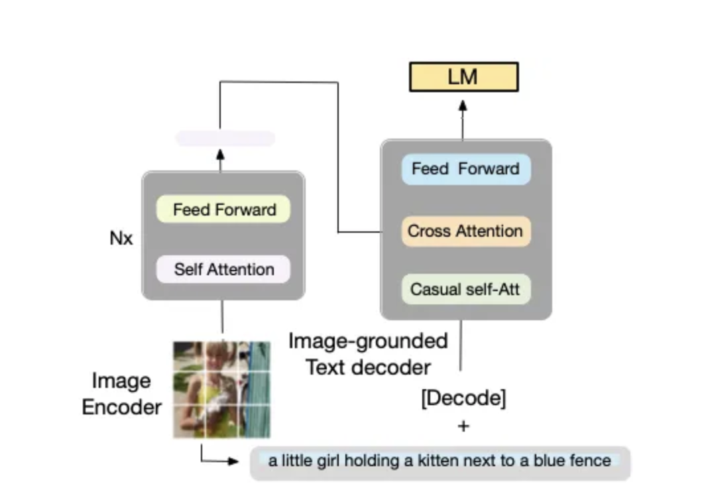
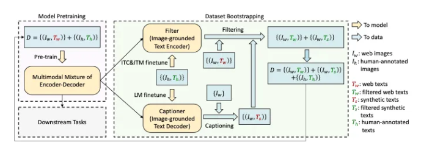
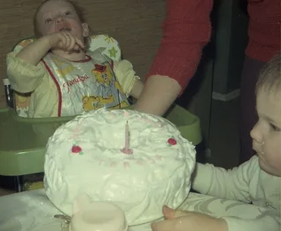

# BLIP: Bootstrapping Language-Image Pre-training

---

## 简述

​	视觉和语言是人类感知世界的两种最基本的方式，也是人工智能的两大基石。人工智能的一个长期目标是构建能够通过视觉和语言输入理解世界，并通过自然语言与人类交流的智能体。

​	为了实现这一目标，***视觉语言预训练*** 已成为一种有效的方法，其中深度神经网络模型在大规模图像文本数据集上进行预训练，以提高下游视觉语言任务的性能，例如 image-文本检索、图像字幕和视觉问答。

​	简而言之，视觉语言预训练旨在利用图像文本数据教会模型共同理解视觉和文本信息的能力。*通过*预训练，模型在微调之前已经过*训练（微调⁄涉及使用来自下游任务的数据对预训练模型进行额外训练。）。**如果没有预训练，模型需要在**每个*下游任务上从头开始训练，这会导致性能下降。

​	视觉语言预训练 (VLP, Vision-Language Pre-training) 提高了许多视觉语言任务的性能。然而，大多数现有的预训练模型仅在基于理解的任务或基于生成的任务中表现出色。此外，通过使用从网络收集的嘈杂图像文本对扩展数据集，性能的提高在很大程度上已经实现，这是次优的监督来源。

​	在本文中，salesforce团队提出了**BLIP**，这是一种新的 VLP 框架，可以灵活地迁移到视觉语言理解和生成任务。BLIP 通过引导字幕有效地利用了嘈杂的网络数据，字幕生成器生成合成字幕，过滤器去除嘈杂的字幕。
这项工作在广泛的视觉语言任务上取得了最先进的结果，例如**图像文本检索(text retrieval)**（+2.7% 的平均召回@1）、**图像字幕(image captioning)**（+2. CIDEr 为 8%）和 **VQA**（VQA 分数为 +1.6%）。当以零样本的方式直接转移到视频语言任务时，BLIP 也表现出强大的泛化能力。

- 代码、模型和数据集在 https://github.com/salesforce/BLIP 上发布。


## 局限性：大多数模型缺乏灵活性，Web 数据嘈杂

尽管视觉语言预训练取得了巨大成功，但现有方法有两个主要*局限性*：

- 从***模型的***角度来看，*大多数现有的预训练模型都不够灵活，无法适应广泛的视觉语言任务*。基于编码器的模型不太容易直接转移到文本生成任务，而编码器-解码器模型尚未成功用于图像-文本检索任务。

- 从***数据的***角度来看，大多数模型都对从网络自动收集的图像和替代文本对进行预训练。然而，*网络文本往往不能准确描述图像的视觉内容*，使它们成为监督的*嘈杂*源。

## 解决方案

为了解决这些限制，我们提出了**BLIP：Bootstrapping Language-Image Pre-training** for unified vision-language understanding and generation。BLIP创新地引入了下面两项工作：

- 一种*新的模型架构*，可以比现有方法实现*更广泛的下游任务，以及*
- 一种*新的数据集引导*方法，用于*从嘈杂的网络数据中学习*。

BLIP在**七项视觉语言任务**上实现了最先进的性能，包括：

- 图文检索
- 图像说明
- 视觉问答
- 视觉推理
- 视觉对话
- 零样本文本视频检索
- 零样本视频问答。


首先，通过字幕生成任务中的一些示例来看一下BLIP是如何生成比以前最先进的模型更准确的字幕的：

<<<<<<< HEAD

=======

>>>>>>> 7b836a65d7c41e1df6fc628370e438002f3bd83e
> 图 1. 来自 COCO-Caption 的第一张图片（Karpathy 测试集）。(COCO_val2014_000000000042.jpg)

```
Transformer (Vaswani et al., 2017): (B4: 38.7)
caption: a dog sitting in a basket with shoes
AoANet (Huang et al., 2019): (B4: 38.9)
caption: a stuffed dog laying in a pile of shoes
OSCAR_Large (Li et al., 2020):(B4: 37.4)
caption: a close up of a dog laying in a basket
------ This work 
BLIP_Large (Li et al., 2022): (B@4: 39.7)
caption Beam search: a dog laying on top of a pile of shoes
caption Nucleus Sampling: a dog sleeping inside of a wire basket
Human annotation: a small dog is curled up on top of the shoes
```

相关材料：
- Web demo [BLIP](https://huggingface.co/spaces/Salesforce/BLIP) (official)
- Colab demo [demo](https://colab.research.google.com/github/salesforce/BLIP/blob/main/demo.ipynb), (official)
- Colab [colab](https://colab.research.google.com/drive/1RNE_nxNrcDcSHSEiBLmMBmC40w9w_yE4?usp=sharing) for multiple images with BLIP_Large, with Beam Search and Nucleus Sampling.
- Github Modified demo [BLIP_image_caption_demo](https://github.com/sabirdvd/BLIP_image_caption_demo) that run locally in your machine.
- Youtube review — Yannic Kilcher [youtube](https://www.youtube.com/watch?v=X2k7n4FuI7c).


##  BLIP的工作原理 

***视觉语言理解和生成的统一模型***

为了预训练具有理解和生成能力的统一视觉语言模型*，* BLIP 引入了**编码器-解码器的多模式混合**，这是一种可以在以下三种功能*之一中运行的多任务模型：

1. ***Unimodal 编码器***，分别对图像和文本进行编码。图像编码器是一个视觉转换器。文本编码器与 BERT 相同。[CLS] 标记附加到文本输入的开头以总结句子。
2. ***Image-grounded text encoder***，它通过在自注意力层和文本编码器的每个转换器块的前馈网络之间插入一个交叉注意力层来注入视觉信息。特定于任务的 [Encode] 标记附加到文本，[Encode] 的输出嵌入用作图像-文本对的多模式表示。
3. ***Image-grounded text decoder***，用因果自注意层替换文本编码器中的双向自注意层。特殊的 [Decode] 标记用于表示序列的开始。

BLIP***在预训练时联合优化了三个目标***，有两个基于理解的目标（ITC，ITM）和一个基于生成的目标（LM）：

- **Image-Text Contrastive Loss (ITC)**激活单峰编码器。它旨在*通过鼓励正图像文本对与负图像文本对具有相似的表示来对齐视觉转换器和文本转换器的特征空间*。
- **Image-Text Matching Loss (ITM)**激活基于图像的文本编码器。ITM 是一项二元分类任务，要求*模型在*给定多模态特征的情况下预测图像-文本对是正（匹配）还是负（不匹配）。
- **语言建模损失 (LM)**激活基于图像的文本解码器，旨在*生成以图像为条件的文本描述*。

在不同的下游任务上，我们微调预训练模型的不同路径以实现不同的目标，如下面的动画所示。

***从嘈杂的图像文本对中引导字幕***

视觉语言预训练依赖于从网络自动收集的大规模图像文本对。然而，文本往往不能准确描述图像的视觉内容，使其成为嘈杂的监督。

为了解决这个问题，*我们通过引入两个模块来引导字幕*：一个***字幕器***和一个***过滤器***。

- 字幕器是一个基于图像的文本解码器。给定网络图像，我们使用字幕生成合成字幕作为额外的训练样本。
- 该过滤器是一个基于图像的文本*编码器*。它删除了与其相应图像不匹配的嘈杂字幕。

接着看下模型架构：

## **模型架构**

该模型使用 Vision Transformer ViT（[Dosovitskiy 等人，2021 年](https://arxiv.org/pdf/2010.11929.pdf)）将输入图像分成多个块，并将它们编码为嵌入序列，并添加 [CLS] 令牌来表示地球图像特征。正如作者所提到的，ViT 使用较少的计算成本并且是一种直接的方法，并且正在被最近的方法采用。
> 请注意，如图 2（下图）所示，大多数基于 Transformer 字幕生成和预训练语言和视觉的方法都使用预计算的特征边界框，这使得这些模型对任何域适应都不友好并且计算量大。例如，对于每张新图像，模型都需要预先计算这个外部特征。
>
> Caption Transformer（[Huang 等人，2019 年](https://arxiv.org/pdf/1908.06954.pdf)；[Cornia 等人，2020 年）](https://openaccess.thecvf.com/content_CVPR_2020/papers/Cornia_Meshed-Memory_Transformer_for_Image_Captioning_CVPR_2020_paper.pdf)和预训练语言和视觉模型（OSCAR（[Li 等人，2020 年](https://arxiv.org/pdf/2004.06165.pdf)）、UNITER（[Chen 等人，2020b](https://arxiv.org/pdf/1909.11740.pdf)））。预计算功能，例如 Faster R-CNN（[Ren 等人，2016 年](https://arxiv.org/pdf/1506.01497.pdf)）和 Buttom-up（安德森[等人，2018 年](https://arxiv.org/pdf/1707.07998.pdf)）。

<<<<<<< HEAD

=======

>>>>>>> 7b836a65d7c41e1df6fc628370e438002f3bd83e
> 图 2. 当前预训练语言和视觉模型的局限性之一是该模型依赖于：
>
> - (1) 在高质量人类注释字幕上进行训练的对象检测器。
> - (2) 计算量大。
> - (3) 需要预先计算这些特征，以便为任何新图像进行推理。

为了能够训练/预训练这种用于理解和生成任务的模型，作者提出了一种**编码**器(**E**ncoder)和**解码器**(**D**ecoder)的多模型混合，它可以集成三个功能，如图 3（下图）所示：

<<<<<<< HEAD

=======

>>>>>>> 7b836a65d7c41e1df6fc628370e438002f3bd83e

> 图 3. BLIP 的预训练模型架构和目标（相同的参数具有相同的颜色）。所提出的编码器-解码器的多模式混合具有三个功能：
>
> - (1)文本编码器（单模式编码器）使用图像文本对比（ITC）进行训练;
> - (2)基于图像的文本编码器使用额外的交叉注意层来建模视觉-语言交互并使用图像-文本匹配 (ITM) 损失进行训练;
> - (3) Image-grounded text decoder 用因果自注意层替换双向自注意层，并共享相同的交叉注意层和前馈网络作为编码器。

下面针对上图，分别更详细地讨论每个部分：

**(1) 单峰编码器。**

该模型对文本和图像进行编码，如图 4（下图）所示。文本编码器与 BERT 相同，即 Mask Language Model (Devlin et al., 2019)，带有 [CLS] 标记以附加文本输入的开头以总结句子。

<<<<<<< HEAD

=======

>>>>>>> 7b836a65d7c41e1df6fc628370e438002f3bd83e
> 图 4.单峰编码器。编码器 使用图像-文本对比 (ITC) 损失进行训练，以对齐视觉和语言表示。

Unimodal 编码器使用Image-Text Contrastive Loss (ITC)。这个想法是 在语义空间中对齐两个特征文本和图像。特别是，由于这项工作依赖于收缩学习，ITC 损失鼓励正图像文本对与负图像文本对具有相似的表示。这一观察是提高视觉和语言理解的有效目标，已在最近的工作 CLIP 中使用（[Radford 等人，2021 年](https://arxiv.org/pdf/2103.00020.pdf)；[Li 等人，2021a](https://arxiv.org/pdf/2201.12086.pdf)）。ITC 损失 ( [Li et al., 2021a](https://arxiv.org/pdf/2201.12086.pdf) ) [฿](https://nips.cc/virtual/2021/poster/28238)使用软标签作为训练目标来解释负对中的潜在正样本。

> ITC 损失是由同一作者提出的。正如作者在他们之前的工作中提到的，ITC 损失有三个目的：
>
> - (1)它对齐图像特征和文本特征，使多模态编码器更容易执行跨模态学习；
> - (2)它改进了单峰编码器以更好地理解图像和文本的语义；
> - (3) 它学习一个共同的低维空间来嵌入图像和文本，这使得图像-文本匹配目标能够通过对比硬负挖掘找到更多信息样本。
>
> 一般而言，所提出的称为**AL** ing **BE** for **F** use ALBEF 的模型使用三种损失
>
> - （1）图像-文本对比损失（ITC），
> - （2）掩码语言建模损失（MLM），以及
> - （3）图像-文本匹配损失（ ITM）与动量蒸馏来学习 SOTA 表示，
> 我们将在下面更详细地讨论。

(2) 基于图像的文本编码器。

编码器依赖于一个额外的交叉注意 (CA) 层（在文本编码器的每个转换器块的自注意 (SA) 层和前馈网络 (FFN) 之间），如下图 6 中的橙色所示. 编码器是特定于任务的，用于编码图像-文本对的多模式表示。

<<<<<<< HEAD

=======

>>>>>>> 7b836a65d7c41e1df6fc628370e438002f3bd83e
> 图 6.基于图像的文本编码器。编码器使用额外的交叉注意层来模拟视觉-语言交互，并使用图像-文本匹配 (ITM) 损失进行训练以区分正负图像-文本对。

Image-grounded 文本编码器 使用Image-Text Matching Loss (ITM)。 ITM 旨在捕捉视觉和语言之间的细粒度对齐。ITM 是二元分类任务，其中模型预测匹配的正例和不匹配的负例对（即，模型充当过滤器）。请注意，为了增加负对，通过对比相似性使用硬负挖掘策略来匹配最相似的负对（Li 等人，2021a）。

(3) 基于图像的文本解码器。

该解码器使用因果自注意（如图 7 中绿色所示）层，这些层由双向自注意设置。因果自注意力用于预测生成任务中的下一个标记。

<<<<<<< HEAD

=======

>>>>>>> 7b836a65d7c41e1df6fc628370e438002f3bd83e

如上所述，为了在利用多任务学习的同时执行高效的预训练：

- 文本编码器和文本解码器共享除自注意力层之外的所有参数（图 3 相同颜色表示共享参数）。原因是编码和解码任务之间的差异最好由自注意力层捕获。
- 编码器采用双向自注意力来构建当前输入标记的表示，
- 而解码器使用因果自注意力来预测下一个标记。

因此，共享这些层可以提高训练效率，同时受益于多任务学习。

## CapFilt

由于人工注释的成本很高，只有有限的高质量人工注释图像对，如 COCO 标题，例如 COCO（Lin 等人，2014）。最近的工作（Li 等人，2021a）在很大程度上依赖于从网络中提取的噪声数据——网络抓取 (WS)。WS 过程是收集大量图像文本对的最快方式，无需人工参与。然而，由于数据是嘈杂的，例如，如下图 8（图像）所示的图像的错误描述，它会影响学习视觉语言对齐信号。

<<<<<<< HEAD

=======

>>>>>>> 7b836a65d7c41e1df6fc628370e438002f3bd83e

> 图 8. 来自网络的错误图像对（人工编写）。
> 文字说明：从我家附近的桥上。（来自图 4 的图像）。

为了解决这个问题，作者提出了字幕和过滤（CapFilt），这是一种提高文本语料库质量的新方法。图 9 给出了 CapFilt 的图示。它引入了两个模块：

- 给定网络图像生成合成字幕的字幕*器。*
- 用于去除噪声图像-文本对的过滤*器*。

字幕**器**和**过滤器**都是从相同的预训练 MED 模型（如上所述）初始化的，并在高质量人工注释的 COCO 数据集（人类数据将用作参考）上分别进行微调。

<<<<<<< HEAD

=======

>>>>>>> 7b836a65d7c41e1df6fc628370e438002f3bd83e

具体来说，如上图 9 所示，字幕器是一个*基于图像的文本解码器*（参见图 7）。它使用 LM 目标进行微调以解码给定图像的文本。

(1) 给定网络图像$I_w$，字幕生成器生成合成字幕$T_s$，每个图像一个字幕。

(2)*过滤器*是一个基于图像的文本编码器。它与 ITC 和 ITM 目标进行了微调，以了解文本是否与图像匹配。该过滤器去除了原始网络文本$T_w$和合成文本$T_s$中的噪声文本，如果 ITM 头预测文本与图像不匹配，则该文本被认为是噪声文本。

(3) 最后，将上述所有内容组合起来（即过滤后的图像文本对与人工注释对）形成一个新的数据集，用于预训练新模型。

预训练模型细节：

- 图像转换器从 ImageNet 上预训练的 ViT 初始化（Touvron 等人，2020 年；Dosovitskiy 等人，2021 年），
- 文本转换器从 BERT_base 初始化（Devlin 等人，2019）。

ViT 有两种变体：ViT-B/16 和 ViT-L/16。

- AdamW (Loshchilov & Hutter, 2017) 用作优化器，权重衰减为 0.05。学习率预热至 3e-4 (ViT-B) / 2e-4 (ViT-L) 并以 0.85 的速率线性衰减。
- 在预训练期间使用分辨率为 224 × 224 的随机图像裁剪。但是，在微调期间使用了更高的图像分辨率 384 × 384。

他们使用与 (Li et al. 2021a) 相同的预训练数据集：

- 两个人类注释数据集 COCO 和 Visual Genome（Krishna 等人，2017）
- 三个网络数据集 Conceptual Captions (Changpinyo et al., 2021)、Conceptual 12M (Changpinyo et al., 2021)、SBU captions (Ordonez et al., 2011)。

CapFilt 的影响。

CapFilt 字幕和从网络过滤噪声数据的想法可以打开大门以更高的精度缩放模型（图像-文本对之间的噪声信号更少）。使用 CapFilt 过滤掉嘈杂的网络数据可以更好地提高不同下游任务的性能，包括图像文本检索和具有微调和零镜头设置的图像字幕。此外，根据作者的说法，当仅将字幕或过滤器应用于具有 14M 图像的数据集时，可以观察到性能改进。

多样性是合成字幕的关键。

在 CapFilt 中，作者使用**Nucleus 采样**（[Holtzman 等人，2020 年](https://arxiv.org/pdf/1904.09751.pdf)）[฿](https://iclr.cc/virtual_2020/poster_rygGQyrFvH.html)生成合成字幕。Nucleus sampling 是一种随机解码方法，其中每个 token 是从一组累积概率质量超过阈值*p*（*p* = 0.9）的 token 中采样的。

作者将其与波束搜索进行了比较，波束搜索是一种旨在以最高概率生成字幕的确定性解码方法。尽管核采样比束搜索更嘈杂，但它会生成更多样化的说明。集束搜索生成更安全的字幕，这些字幕在重复时很常见（集束搜索的缺点），因此提供的知识较少。简而言之，Nucleus 采样带来了明显更好的性能，尽管如图 10（图像）所示滤波器的更高噪声比表明噪声更大，但 Nucleus 采样生成了更多样化的说明：

<<<<<<< HEAD

=======

>>>>>>> 7b836a65d7c41e1df6fc628370e438002f3bd83e
> 图 10. Beam Search 和 Nucleus 采样之间的比较。
> Beam Search K=3：一个婴儿坐在高脚椅上吃蛋糕。
> Nucleus sampling：一个婴儿吃着他的生日蛋糕，和他妈妈坐在一起。

核采样导致明显更好的性能，尽管滤波器的噪声比更高表明噪声更大，但结果与最终波束搜索相当
作者假设原因是细胞核采样产生了更多样化和令人惊讶的说明，其中包含更多模型可以从中受益的新信息。另一方面，集束搜索倾向于生成数据集中常见的安全说明，因此提供的额外知识较少。

预训练期间的参数共享和解耦。
文本编码器和解码器共享除自注意力层之外的所有参数。
对具有不同参数共享策略的预训练模型的评估，其中对 1400 万张带有网络文本的图像进行了预训练。结果表明，与不共享相比，共享除 Self Attention 之外的所有层会带来更好的性能，同时还可以减小模型大小，从而提高训练效率。如果共享自注意力层，由于编码任务和解码任务之间的冲突，模型的性能会下降。


------

## **展望发展**

BLIP 研究对 AI 及其他领域都有好处：

- 人工智能的好处：BLIP 对人工智能的贡献包括：

  - 为统一的基于图像的文本理解和生成任务生成最先进的视觉语言预训练模型
  - 引入了一个从嘈杂的网络数据中学习的新框架
    - 通过以下方式处理噪音：
      - 生成合成字幕作为额外的训练样本
      - 去除嘈杂的字幕
  
- *更广泛的（一般）影响*：BLIP 可以使广泛的下游应用程序具有更好的视觉语言智能，例如电子商务平台中的产品推荐和分类。

## **总结** 

- 视觉语言研究是：
  - 一个核心人工智能问题，因为视觉和语言是世界上两种基本的信息形式
  - 一个重要的应用领域，因为许多工业 AI 应用程序都由视觉语言智能提供支持。
- 本文使用框架称为 BLIP，介绍了：
  - 一种新的模型架构，可实现比现有方法更广泛的下游任务
  - 一种新的数据集引导方法，用于从嘈杂的网络数据中学习。
- BLIP 框架为深度学习和 AI 做出了宝贵贡献：
  - 为统一的基于图像的文本理解和生成任务生成最先进的视觉语言预训练模型
  - BLIP 从嘈杂的网络数据中学习的新框架很有价值，因为网络收集的图像描述通常不准确 - 即嘈杂。
  - 提供简单、灵活且功能强大的视觉语言模型，可以端到端地进行微调
    - 我们对预训练模型的不同路径进行微调，以在不同的下游任务上实现不同的目标
  - 在图像文本检索、图像字幕、视觉问答、视觉推理和视觉对话方面实现了最先进的性能。
  - 当以零样本的方式直接转移到视频语言任务时，表现出很强的泛化能力。
- BLIP 还提供更广泛的好处：
  - 使广泛的下游应用具有更好的视觉语言智能，例如电子商务平台中的产品推荐和分类。
- 演示示例显示 BLIP 可以：
  - 生成准确详细的图像说明
  - 为各种问题生成准确的答案。

这项工作提出了一种视觉和语言预训练框架（VLP）（训练技术和预训练模型），它在广泛的下游视觉语言任务上实现了最先进的性能，包括理解和基于生成的任务。此外，他们克服了当前最先进技术所面临的三个限制：

- (1) 视觉块依赖于（见图 2）预先训练的对象检测器来提取预先计算的特征。此外，目标检测器需要边界框人工标注，这是昂贵的。此外，提取的特征在计算上是昂贵的，并且在推理过程中任何新图像都需要它。

- (2) 从不同的语义空间中提取词嵌入和标题特征。

- (3) 目前的对比学习方法使用从网络收集的非常嘈杂的数据，这会影响 (1) 准确性和 (2) 增加模型参数/图像，性能略好（如表 2 Lemon 所示，只有 71M 额外图像B@4) 的 0.6 改进)。

通过解决这些限制，所提出的模型可以:

- (1) 易于适应任何下游任务；
- (2) 需要更少的训练示例，图像噪声更少，精度更高。
